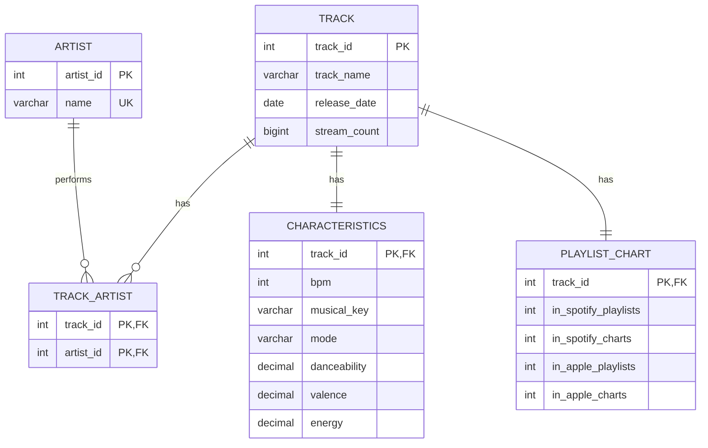

# Spotify Database Analysis

Group academic project designing and analysing a relational database of music streaming data using **MySQL, SQL, Python and Pandas**.

> Originally developed for a **Databases and Big Data** course during my Bachelor's degree. The codebase was later reorganized and refactored for this portfolio repository while preserving the original project goals.

## Project Overview

The project transforms a 953-track dataset into a relational MySQL database and uses SQL to answer questions about streaming performance, artists, playlist exposure and musical characteristics.

The portfolio version focuses on four areas:

- relational database design and normalization;
- data cleaning and ETL with Python/Pandas;
- SQL querying and aggregation;
- reproducible configuration and documentation.

## Technologies

- **MySQL** - relational database
- **SQL** - schema definition and analytical queries
- **Python** - ETL and interactive query tool
- **Pandas** - data cleaning and transformation
- **PyMySQL** - Python/MySQL connection

## Database Design

The original academic schema was refined so collaborations are represented correctly with a many-to-many relationship between tracks and artists.



## Analytical Queries

The repository contains nine analyses:

1. Most streamed tracks
2. Most popular artists by total streams
3. Average BPM, energy and danceability
4. Tracks appearing in the most Spotify playlists/charts
5. Track count by release year
6. Average energy by musical mode
7. Most danceable tracks
8. Tracks with the highest valence
9. Most streamed collaborative tracks

See [`sql/queries.sql`](sql/queries.sql) for the complete SQL and [`docs/sample_results.md`](docs/sample_results.md) for example results.

## Data Cleaning

The loader performs defensive preprocessing before inserting records into MySQL:

- converts numeric columns safely;
- removes commas from numeric strings;
- converts invalid numeric values to SQL `NULL`;
- constructs a valid `release_date` from year/month/day;
- splits collaborative artist strings into normalized artist records.

The source dataset contains **953 tracks and 25 columns**, spanning **1930-2023**. One source row contains a malformed value in `streams`; the portfolio loader preserves the track and stores that value as `NULL` instead of dropping the record.

## Project Structure

```text
spotify_database_analysis/
├── README.md
├── requirements.txt
├── .env.example
├── data/
│   ├── spotify_most_streamed_songs.csv
│   └── README.md
├── sql/
│   ├── schema.sql
│   └── queries.sql
├── src/
│   ├── db.py
│   ├── data_utils.py
│   ├── data_loader.py
│   └── query_tool.py
├── tests/
│   └── test_data_cleaning.py
└── docs/
    ├── academic_presentation.pdf
    ├── refactoring_notes.md
    └── sample_results.md
```

## How to Run

### 1. Create a virtual environment

```bash
python -m venv .venv
```

Activate it and install dependencies:

```bash
pip install -r requirements.txt
```

### 2. Configure MySQL

Copy `.env.example` to `.env` and enter your local MySQL credentials:

```text
DB_HOST=localhost
DB_PORT=3306
DB_USER=root
DB_PASSWORD=your_mysql_password
DB_NAME=spotify_most_streamed_songs
```

`.env` is excluded by `.gitignore`, so credentials are not committed.

### 3. Create the database

From a terminal with MySQL available:

```bash
mysql -u root -p < sql/schema.sql
```

### 4. Load the data

```bash
python src/data_loader.py
```

### 5. Run the interactive query tool

```bash
python src/query_tool.py
```

Choose a query from `1` to `9` from the menu.

### 6. Run the cleaning tests

```bash
python -m unittest discover -s tests
```

## Academic Deliverable

A sanitized copy of the original group presentation is available in [`docs/academic_presentation.pdf`](docs/academic_presentation.pdf). The presentation reflects the original academic submission; the schema, loader and query logic in this repository represent the later portfolio refactor.

For a summary of the changes, see [`docs/refactoring_notes.md`](docs/refactoring_notes.md).
